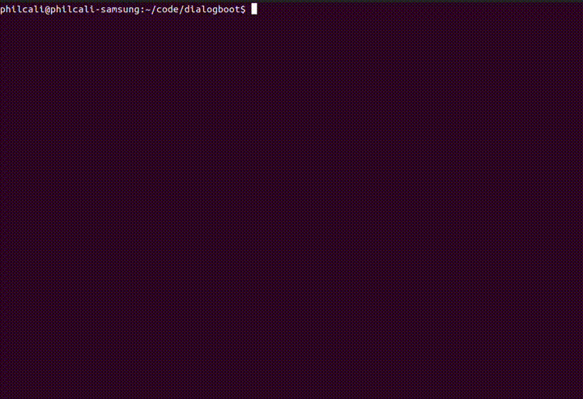

# Example Dracut Dialog Module

The purpose of this respository is to demonstrate how to incorporate
user input during a custom boot process facilitiated through a [dracut][1]
built initrd. Why would someone do this? Here are some of the use-cases:

1. __Finish a first time install__: If you are familiar with the minimal
Raspberry Pi installation, you will know what I mean. The created user for
the minimal install is completed using a dialog at the tail of the initial
boot.
2. __Locked disk drives__: In normal situations, a device can facilitate
measured boot protection (encrypted system drives using an HSM). With a dialog
perhaps there could be warning about what happened and what to do next.
3. __Text base install wizards__: A direct boot Linux image can facilitate
a manual flashing using the dialog UI for some of the parameters.



## Building This Example

The quickest way to test this module is to build the initrd image within
a docker container (see this image), and direct boot from it using [qemu][2].

The follow prerequisites:

1. Install [docker][3] for your platform.
2. `apt-get install qemu qemu-system-x86`

Once you have the completed the above, continue below:

1. Build the image: `docker build -t dracut .`
2. Jump into the image: `docker run -it --rm --name dracut -v $PWD:/source:rw dracut`
3. Build the image:
```
(cd source && cp -r 95dialogboot /usr/lib/dracut/modules.d/ && dracut -H boot-dialog.img)
```
4. Finally, direct boot using this ramd:
```
sudo qemu-system-x86_64 -kernel /boot/vmlinuz-$(uname -r) -initrd boot-dialog.img --append "rd.info"
```

You will see the example dialog on `pre-mount`. Pressing esc or ctl-c will continue the dracut execution.


## What's next?

In *almost all* cases, the idea of halting the boot procedure for human interaction is a cause for concern.
Enabling this behavior is something that is considered something of a "last resort", with an example being
an oeprator is performing a human assisted flash of a device (ie: respberry pi). The boot should always
be very fast and should not block! With that tenet in place, this repository will likely remain strictly
an *example* to demonstrate that these exstenuating circumstances can be handled.

[1]: https://man7.org/linux/man-pages/man8/dracut.8.html
[2]: https://www.qemu.org/docs/master/system/linuxboot.html
[3]: https://docs.docker.com/engine/install/
